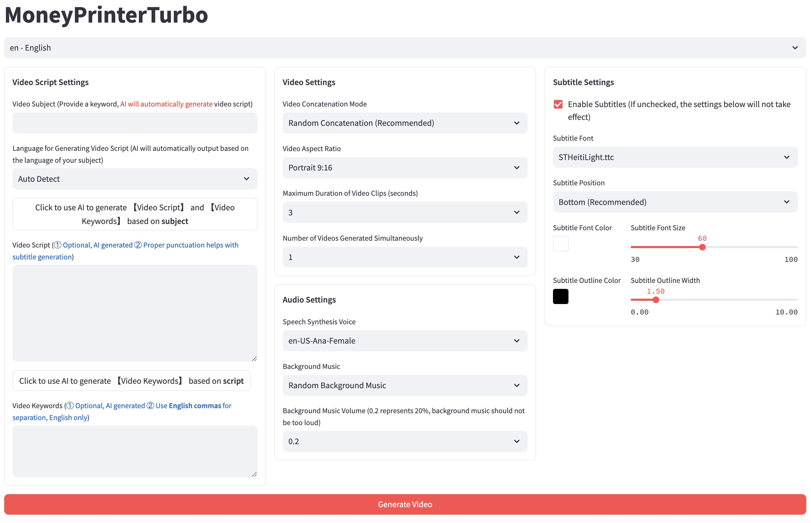
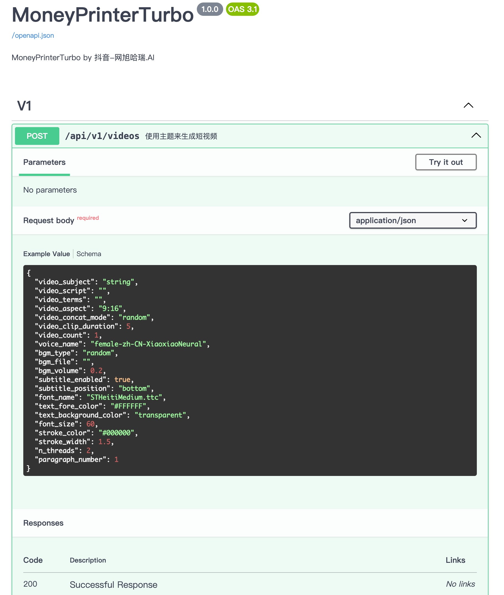

<div align="center">
<h1 align="center">MoneyPrinterTurbo 💸</h1>

<p align="center">
  <a href="https://github.com/harry0703/MoneyPrinterTurbo/stargazers"></a>
  <a href="https://github.com/harry0703/MoneyPrinterTurbo/issues"></a>
  <a href="https://github.com/harry0703/MoneyPrinterTurbo/network/members"></a>
  <a href="https://github.com/harry0703/MoneyPrinterTurbo/blob/main/LICENSE"></a>
</p>

<div align="center">
  <a href="https://trendshift.io/repositories/8731" target="_blank"></a>
</div>

Simply provide a <b>topic</b> or <b>keyword</b> for a video, and it will automatically generate the video copy, video
materials, video subtitles, and video background music before synthesizing a high-definition short video.

### WebUI



### API Interface



</div>

## Setup (this fork) 🛠️

This fork adds a channel-profile + idea-generation workflow on top of the original project, and stores large font binaries (`*.ttc`) via **Git LFS**. You must have Git LFS installed before cloning, otherwise font files will come down as ~130-byte pointer stubs and subtitle rendering for CJK text will break.

### Prerequisites

| Tool | Why | Install (macOS / Linux) |
|---|---|---|
| Git LFS | Fetches the `*.ttc` fonts under `resource/fonts/` | `brew install git-lfs` then `git lfs install` |
| Python 3.11 | Runtime | `brew install python@3.11` or pyenv |
| uv | Primary package manager | `curl -LsSf https://astral.sh/uv/install.sh \| sh` |
| ImageMagick 7.1.1+ | MoviePy subtitle rendering | `brew install imagemagick` |
| FFmpeg | Video encoding | `brew install ffmpeg` (auto-downloaded by imageio-ffmpeg if missing) |

Windows users: install Git LFS from [git-lfs.com](https://git-lfs.com/), then run `git lfs install` once.

### Clone with LFS content

```bash
# The LFS hooks are enabled on first `git lfs install`, so a normal clone
# automatically fetches the binaries. If you already cloned without LFS,
# `git lfs pull` inside the repo will fetch them after the fact.

git clone https://github.com/dimasaenko/money-printer.git
cd money-printer
git lfs pull          # no-op if clone already fetched LFS objects
```

Verify the fonts landed as real binaries, not pointer stubs:

```bash
ls -lh resource/fonts/STHeitiLight.ttc   # should be ~53 MB, not ~130 B
file resource/fonts/STHeitiLight.ttc     # should NOT say "ASCII text"
```

If the file is tiny / shows `ASCII text`, you skipped `git lfs install` before cloning — run `git lfs pull` to fix it.

### Install + run

```bash
# Install Python dependencies
uv sync --frozen

# Copy the example config (first run only)
cp config.example.toml config.toml
# then edit config.toml to add pexels_api_keys and an LLM provider key

# Run the FastAPI server (http://127.0.0.1:8080, docs at /docs)
uv run python main.py

# In a separate terminal: run the Streamlit WebUI (http://127.0.0.1:8501)
uv run streamlit run ./webui/Main.py --browser.gatherUsageStats=False
```

The FastAPI server and the WebUI are **parallel entry points** that share the same `app/services/*` modules — the WebUI does not call the API over HTTP. Either can run alone.

### Docker

```bash
docker-compose up                            # webui + api containers
docker-compose -f docker-compose.gpu.yml up  # GPU variant
```

Note: the Docker build context includes the LFS-backed fonts, so the Docker host needs Git LFS installed *before* the image is built.

### Tests

```bash
python -m unittest discover -s test
python -m unittest test/services/test_video.py                                    # single file
python -m unittest test.services.test_video.TestVideoService.test_preprocess_video  # single method
```

### Project docs

- [`docs/Backend.md`](docs/Backend.md) — FastAPI app, services, task pipeline, config, storage.
- [`docs/Frontend.md`](docs/Frontend.md) — Streamlit WebUI layout, channel/idea panels, i18n.

### Adding more large binaries later

Anything matching `*.ttc` is already LFS-tracked (see `.gitattributes`). To track additional large file types:

```bash
git lfs track "*.mp4"
git add .gitattributes
# then add+commit the new binaries normally
```

To retroactively move an already-committed file into LFS, use `git lfs migrate import --include="<pattern>" --include-ref=refs/heads/main`, then `git push --force origin main`. This rewrites history — coordinate with collaborators first.

---

## Features 🎯

- [x] Complete **MVC architecture**, **clearly structured** code, easy to maintain, supports both `API`
  and `Web interface`
- [x] Supports **AI-generated** video copy, as well as **customized copy**
- [x] Supports various **high-definition video** sizes
    - [x] Portrait 9:16, `1080x1920`
    - [x] Landscape 16:9, `1920x1080`
- [x] Supports **batch video generation**, allowing the creation of multiple videos at once, then selecting the most
  satisfactory one
- [x] Supports setting the **duration of video clips**, facilitating adjustments to material switching frequency
- [x] Supports video copy in multiple languages
- [x] Supports **multiple voice** synthesis, with **real-time preview** of effects
- [x] Supports **subtitle generation**, with adjustable `font`, `position`, `color`, `size`, and also
  supports `subtitle outlining`
- [x] Supports **background music**, either random or specified music files, with adjustable `background music volume`
- [x] Video material sources are **high-definition** and **royalty-free**, and you can also use your own **local materials**
- [x] Supports integration with various models such as **OpenAI**, **Moonshot**, **Azure**, **gpt4free**, **one-api**, **Qwen**, **Google Gemini**, **Ollama**, **DeepSeek**, **MiniMax**, **ERNIE**, **Pollinations**, **ModelScope** and more

## Video Demos 📺

### Portrait 9:16

<table>
<thead>
<tr>
<th align="center"><g-emoji class="g-emoji" alias="arrow_forward">▶️</g-emoji> How to Add Fun to Your Life </th>
<th align="center"><g-emoji class="g-emoji" alias="arrow_forward">▶️</g-emoji> What is the Meaning of Life</th>
</tr>
</thead>
<tbody>
<tr>
<td align="center"><video src="https://github.com/harry0703/MoneyPrinterTurbo/assets/4928832/a84d33d5-27a2-4aba-8fd0-9fb2bd91c6a6"></video></td>
<td align="center"><video src="https://github.com/harry0703/MoneyPrinterTurbo/assets/4928832/112c9564-d52b-4472-99ad-970b75f66476"></video></td>
</tr>
</tbody>
</table>

### Landscape 16:9

<table>
<thead>
<tr>
<th align="center"><g-emoji class="g-emoji" alias="arrow_forward">▶️</g-emoji> What is the Meaning of Life</th>
<th align="center"><g-emoji class="g-emoji" alias="arrow_forward">▶️</g-emoji> Why Exercise</th>
</tr>
</thead>
<tbody>
<tr>
<td align="center"><video src="https://github.com/harry0703/MoneyPrinterTurbo/assets/4928832/346ebb15-c55f-47a9-a653-114f08bb8073"></video></td>
<td align="center"><video src="https://github.com/harry0703/MoneyPrinterTurbo/assets/4928832/271f2fae-8283-44a0-8aa0-0ed8f9a6fa87"></video></td>
</tr>
</tbody>
</table>

## System Requirements 📦

- Recommended platforms: Windows 10+, macOS 11+, or a mainstream Linux distribution
- A GPU is not required, but it is recommended if you want faster local transcription, faster video processing, or smoother batch generation

| Item | Minimum | Recommended | Optimal |
| --- | --- | --- | --- |
| CPU | 4 cores | 6 to 8 cores | 8+ cores |
| RAM | 4 GB | 8 GB | 16+ GB |
| GPU | Not required | 4+ GB VRAM | 8+ GB VRAM |

- If you mainly rely on cloud LLMs, cloud TTS, and online material sources, CPU and RAM matter more than GPU
- If you use `faster-whisper`, batch generation, or heavier local processing, a GPU will improve throughput noticeably

## Voice Synthesis 🗣

A list of all supported voices can be viewed here: [Voice List](./docs/voice-list.txt)

## Subtitle Generation 📜

Currently, there are 2 ways to generate subtitles:

- **edge**: Faster generation speed, better performance, no specific requirements for computer configuration, but the
  quality may be unstable
- **whisper**: Slower generation speed, poorer performance, specific requirements for computer configuration, but more
  reliable quality

You can switch between them by modifying the `subtitle_provider` in the `config.toml` configuration file

It is recommended to use `edge` mode, and switch to `whisper` mode if the quality of the subtitles generated is not
satisfactory.

> Note:
>
> 1. In whisper mode, you need to download a model file from HuggingFace, about 3GB in size, please ensure good internet connectivity
> 2. If left blank, it means no subtitles will be generated.

After downloading the `whisper-large-v3` model, extract it and place the entire directory in `./models`.
The final file path should look like this: `./models/whisper-large-v3`

```
MoneyPrinterTurbo
  ├─models
  │   └─whisper-large-v3
  │          config.json
  │          model.bin
  │          preprocessor_config.json
  │          tokenizer.json
  │          vocabulary.json
```

## Background Music 🎵

Background music for videos is located in the project's `resource/songs` directory.
> The current project includes some default music from YouTube videos. If there are copyright issues, please delete
> them.

## Subtitle Fonts 🅰

Fonts for rendering video subtitles are located in the project's `resource/fonts` directory, and you can also add your
own fonts.

## Common Questions 🤔

### ❓RuntimeError: No ffmpeg exe could be found

Normally, ffmpeg will be automatically downloaded and detected.
However, if your environment has issues preventing automatic downloads, you may encounter the following error:

```
RuntimeError: No ffmpeg exe could be found.
Install ffmpeg on your system, or set the IMAGEIO_FFMPEG_EXE environment variable.
```

In this case, you can download ffmpeg from https://www.gyan.dev/ffmpeg/builds/, unzip it, and set `ffmpeg_path` to your
actual installation path.

```toml
[app]
# Please set according to your actual path, note that Windows path separators are \\
ffmpeg_path = "C:\\path\\to\\ffmpeg.exe"
```

### ❓ImageMagick is not installed on your computer

[issue 33](https://github.com/harry0703/MoneyPrinterTurbo/issues/33)

1. Follow the `example configuration` provided `download address` to
   install https://imagemagick.org/archive/binaries/ImageMagick-7.1.1-30-Q16-x64-static.exe, using the static library
2. Do not install in a path with special characters to avoid unpredictable issues

### ❓ImageMagick's security policy prevents operations related to temporary file @/tmp/tmpur5hyyto.txt

You can find these policies in ImageMagick's configuration file policy.xml.
This file is usually located in /etc/ImageMagick-`X`/ or a similar location in the ImageMagick installation directory.
Modify the entry containing `pattern="@"`, change `rights="none"` to `rights="read|write"` to allow read and write operations on files.

### ❓OSError: [Errno 24] Too many open files

This issue is caused by the system's limit on the number of open files. You can solve it by modifying the system's file open limit.

Check the current limit:

```shell
ulimit -n
```

If it's too low, you can increase it, for example:

```shell
ulimit -n 10240
```

## Feedback & Suggestions 📢

- You can submit an [issue](https://github.com/dimasaenko/money-printer/issues) or
  a [pull request](https://github.com/dimasaenko/money-printer/pulls).

## License 📝

Click to view the [`LICENSE`](LICENSE) file

## Star History

[](https://star-history.com/#harry0703/MoneyPrinterTurbo&Date)
